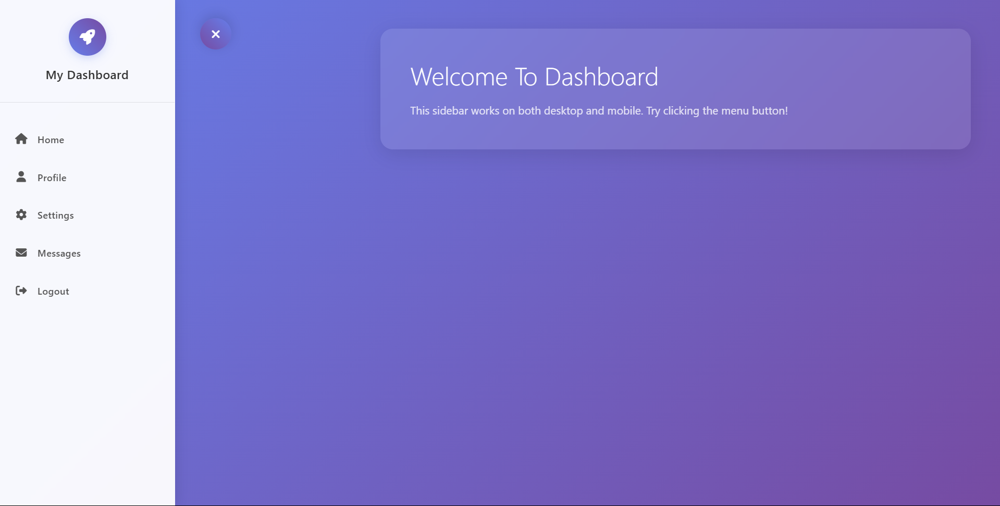

# Collapsible Sidebar

CollapsibleSideNav is a fully responsive sidebar navigation system that allows users to toggle a menu with smooth animations. Built using vanilla HTML, CSS, and JavaScript, the project combines modern design principles with interactive features and animations.

📌 Key Features
1. 🔄 Toggle Functionality
Users can click a button to open or close the sidebar.
The button icon transitions from a hamburger menu to a close icon.

2. 🎞️ Animations
Pop-and-slide effect for the sidebar opening and closing.
Logo pop-in animation on sidebar open.
Staggered slide-in effect for navigation items.

3. 🌐 Responsive Design
Fixed sidebar on desktop screens (>768px).
Collapsible sidebar with an overlay on mobile screens (≤768px).
Fully optimized for various screen sizes.

4. 🎨 Hover Effects
Linear gradient background applied to nav items on hover.
Smooth transition with a slight right shift and shadow.

5. ✅ Active State
Clicked nav item is highlighted with a persistent linear gradient.
Supports navigation for Home, Profile, Settings, Messages, and Logout.

6. ♿ Accessibility
Includes ARIA attributes for screen readers.
Escape key support to close the sidebar on mobile.

🧠 Covered Concepts
DOM Manipulation
CSS Animations and Transitions
Event Handling
Responsive Web Design
Accessibility Features

🏆 Bonus Features
Smooth icon transition on toggle button.
Reset of animations when reopening the sidebar.
Keyboard navigation support.

